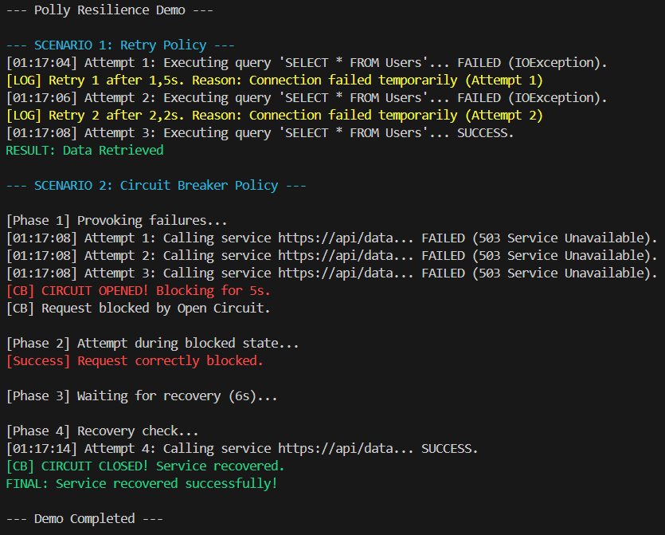

# Звіт до Самостійної роботи №11: Кейси Polly (Retry та Circuit Breaker)

## 1. Мета та Огляд

Метою цієї роботи було дослідження бібліотеки Polly для забезпечення відмовостійкості (resilience) .NET-застосунків. Було реалізовано два ключових сценарії: обробка тимчасових збоїв за допомогою політики Retry та запобігання каскадним збоям за допомогою політики Circuit Breaker.

---

## 2. Сценарій 1: Доступ до Бази Даних (Retry Policy)

### Опис проблеми
При роботі з базами даних часто виникають короткочасні збої, такі як:
* Тимчасова втрата мережевого з'єднання.
* Блокування транзакцій (deadlocks).
* Перевищення ліміту підключень.

Ці помилки зазвичай зникають через кілька мілісекунд або секунд. Якщо просто викинути виняток, користувач отримає помилку, хоча повторний запит міг би бути успішним.

### Обрана політика: WaitAndRetry (Експоненційна затримка)
Було обрано політику Retry з експоненційною затримкою (Exponential Backoff).

* **Чому Retry?** Тому що помилка є тимчасовою (IOException у нашій імітації).
* **Чому експоненційна затримка?** Замість миттєвого повтору, ми чекаємо прогресивно довше (1.5 у степені n секунд). Це дає базі даних час на відновлення і запобігає ефекту масованих повторних запитів, коли всі клієнти одночасно перевантажують сервер.

### Реалізація
Імітується метод CallDatabaseQuery, який викидає IOException перші 2 рази.
Політика налаштована на 3 спроби.

**Очікувана поведінка:**
1. Спроба 1 -> Помилка -> Чекаємо приблизно 1.5с.
2. Спроба 2 -> Помилка -> Чекаємо приблизно 2.25с.
3. Спроба 3 -> Успіх.
4. Результат повертається користувачу прозоро, ніби помилок не було.

---

## 3. Сценарій 2: Зовнішній Сервіс (Circuit Breaker Policy)

### Опис проблеми
Зовнішній HTTP-сервіс може стати недоступним (наприклад, помилка 503 або тайм-аут). Якщо наш додаток продовжуватиме надсилати запити до несправного сервісу:
1. Ми витрачаємо власні ресурси (потоки, пам'ять) на очікування тайм-аутів.
2. Ми додатково навантажуємо зовнішній сервіс, не даючи йому відновитися.
3. Користувач довго чекає на відповідь, яка все одно буде помилкою.

### Обрана політика: Circuit Breaker (Автоматичний Вимикач)
Ця політика працює як електричний запобіжник. Вона відстежує кількість помилок, і якщо їх стає забагато, вона розмикає коло.

* **Чому Circuit Breaker?** Помилка є системною або тривалою (сервер не відповідає). Повторні запити тут тільки зашкодять.
* **Як це працює?** Після певної кількості невдач (3 рази) політика миттєво блокує всі наступні запити на певний час (5 секунд), викидаючи виняток BrokenCircuitException без звернення до зовнішнього сервісу.

### Реалізація
Імітується метод CallFailingExternalService, який постійно видає помилки на початку.
Політика налаштована на розмикання після 3 помилок із паузою в 5 секунд.

**Очікувана поведінка:**
1. **Фаза помилок:** 3 запити поспіль завершуються помилкою.
2. **Фаза блокування (Open):** Circuit Breaker відкривається. Наступні запити миттєво блокуються.
3. **Фаза відновлення (Half-Open):** Через 5 секунд політика пропускає один пробний запит. Якщо він успішний — робота відновлюється.

---

## 4. Демонстрація роботи

Нижче наведено скріншот виводу програми, який підтверджує коректну роботу обох сценаріїв:

---

## 5. Висновки

Використання бібліотеки Polly дозволяє значно підвищити надійність системи, відокремлюючи логіку обробки збоїв від бізнес-логіки. Комбінація Retry для короткочасних збоїв та Circuit Breaker для тривалих проблем є стандартом у розробці розподілених систем та мікросервісів.