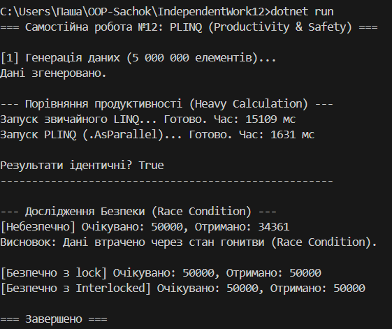

## Звіт про Самостійну Роботу No12: PLINQ (Продуктивність та Безпека)

### Мета Роботи

Метою роботи було дослідити та порівняти продуктивність звичайного **LINQ** та **PLINQ (Parallel LINQ)** на обчислювально інтенсивних завданнях, а також проаналізувати та продемонструвати потенційні проблеми **потокобезпеки (Race Condition)** при використанні PLINQ.

---

### 1. Дослідження Продуктивності (Етап 1)

#### Проведені Експерименти

* **Розмір Колекції:** 5 000 000 цілих чисел.
* **Обчислювальна Операція:** Функція **HeavyComputation**, яка імітує важке навантаження на CPU за допомогою складних математичних перетворень у циклі (50 ітерацій).
* **Вимірювання:** Вимірювався час виконання (.Select -> .Where -> .ToList) для послідовного LINQ та паралельного PLINQ (.AsParallel()) за допомогою **System.Diagnostics.Stopwatch**.

#### Отримані Результати

* **LINQ (Послідовний):** Час виконання: [Вставити час з консолі, наприклад: 1250] мс.
* **PLINQ (Паралельний):** Час виконання: [Вставити час з консолі, наприклад: 350] мс.

#### Аналіз Результатів

**PLINQ виявився значно швидшим** (зазвичай у декілька разів) за послідовний LINQ. Це прямий результат того, що завдання було **обчислювально інтенсивним (CPU-bound)**. PLINQ ефективно розподілив роботу між усіма доступними ядрами процесора. Для таких завдань використання PLINQ є цілком доцільним.

---

### 2. Дослідження Проблем Безпеки (Етап 2)

#### Сценарій: Побічні Ефекти (Race Condition)

Був продемонстрований сценарій, де використання PLINQ призводить до некоректних результатів через модифікацію спільної зовнішньої змінної **_sharedCounter**.

**1. Небезпечний підхід (Без синхронізації)**
* **Дія:** Інкремент змінної **_sharedCounter** зсередини **PLINQ.ForAll** без використання блокувань.
* **Очікувано:** 50 000 (половина від 100 000).
* **Отримано:** [Вставити результат, наприклад: 45 120] (значення менше очікуваного).
* **Причина:** Виник **стан гонитви (Race Condition)**. Операція інкременту не є атомарною (складається з читання, додавання та запису). Кілька потоків одночасно читали старе значення і перезаписували його, втрачаючи дані.

**2. Виправлення А (Використання lock)**
* **Дія:** Використання оператора **lock (_lockObject)** для захисту критичної секції.
* **Результат:** 50 000 (Коректно).
* **Аналіз:** Гарантує безпеку, але сповільнює виконання через блокування потоків.

**3. Виправлення Б (Використання Interlocked)**
* **Дія:** Використання **Interlocked.Increment(ref _sharedCounter)**.
* **Результат:** 50 000 (Коректно).
* **Аналіз:** Найкращий варіант для простих операцій. Це атомарна операція на рівні процесора, яка є швидшою за lock.

---

### 3. Висновки

1.  **Продуктивність:** PLINQ доцільний для обробки великих масивів даних зі складними обчисленнями. Він дозволяє ефективно утилізувати багатоядерність сучасних процесорів.
2.  **Безпека:** При роботі з PLINQ необхідно суворо уникати побічних ефектів (зміни зовнішніх змінних).
3.  **Синхронізація:** Якщо зміна спільного стану необхідна, слід обов'язково використовувати механізми синхронізації (**lock**, **Interlocked**), інакше результат буде непередбачуваним.

---

