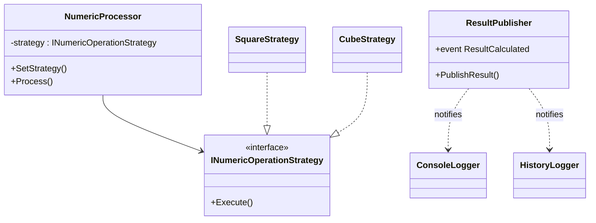

# Лабораторна робота №24: Strategy + Observer

**Тема:** Динамічна підстановка алгоритмів та реактивні сповіщення.  
**Мета:** Реалізувати гнучку систему обробки даних, де алгоритм можна змінювати "на льоту" (Strategy), а результати автоматично надсилаються всім зацікавленим модулям (Observer).

## 1. Опис реалізації

### Патерн Strategy
Використовується для інкапсуляції алгоритмів математичних операцій. Це дозволяє класу `NumericProcessor` не знати деталей обчислень, а просто викликати метод `Execute()`.

* **Інтерфейс:** `INumericOperationStrategy`
* **Реалізації:**
    * `SquareOperationStrategy` (піднесення до квадрату)
    * `CubeOperationStrategy` (піднесення до кубу)
    * `SquareRootOperationStrategy` (квадратний корінь)
* **Контекст:** Клас `NumericProcessor` дозволяє змінювати стратегію через метод `SetStrategy()` під час виконання програми.

### Патерн Observer
Реалізований через вбудований механізм подій C# (`event Action<...>`). Це дозволяє забезпечити слабку зв'язаність (Loose Coupling) між генератором результату та споживачами.

* **Subject (Видавець):** `ResultPublisher`. Має подію `ResultCalculated`.
* **Observers (Підписники):**
    1.  `ConsoleLoggerObserver` — просто виводить дані в консоль.
    2.  `HistoryLoggerObserver` — накопичує історію обчислень у списку.
    3.  `ThresholdNotifierObserver` — перевіряє бізнес-правило (чи перевищує число поріг) і виводить попередження червоним кольором.

## 2. UML діаграма класів (спрощена)

## 3. Результати роботи
При зміні стратегії на `CubeOperationStrategy` для числа 5, результат склав **125**. 
Оскільки це більше порогового значення (100), спрацював `ThresholdNotifierObserver`, вивівши попередження.
Всі операції були успішно записані в історію `HistoryLoggerObserver`.

## Висновок
Поєднання патернів **Strategy** та **Observer** дозволило створити модульну систему. 
Ми можемо додавати нові математичні операції (наприклад, `LogarithmStrategy`) або нові реакції на результат (наприклад, `EmailSenderObserver`) без зміни існуючого коду `NumericProcessor`.
