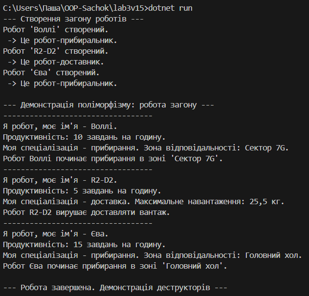

# Звіт до лабораторної роботи №3
## Спадкування та поліморфізм

---

### Тема та мета роботи

**Тема:** Реалізація принципів спадкування та поліморфізму на мові програмування C#.

**Мета:** Набути практичних навичок у створенні ієрархії класів, використанні абстрактних класів та методів, перевизначенні методів (`virtual`/`override`), виклику конструкторів базового класу (`base`) та демонстрації поліморфізму.

---

### Опис реалізації

У ході виконання роботи була створена ієрархія класів, що моделює поведінку роботів:

* **`Robot`** — абстрактний базовий клас, який містить загальні для всіх роботів поля (`Name`, `TasksPerHour`), конструктор, деструктор, віртуальний метод `ShowInfo()` та абстрактний метод `Work()`, що вимагає реалізації у похідних класах.

* **`CleanerRobot`** та **`DeliveryRobot`** — два похідні класи, що успадковуються від `Robot`. Кожен з них реалізує власну версію методу `Work()` та розширює функціонал методу `ShowInfo()`, демонструючи перевизначення.

У головному файлі `Program.cs` створено список типу `List<Robot>`, до якого додано об'єкти обох дочірніх класів. Завдяки поліморфізму, в циклі для кожного робота викликається відповідна версія методів, що підтверджує коректність побудованої ієрархії.

---

### Приклад запуску

Для отримання результату необхідно виконати команду `dotnet run` у терміналі, перебуваючи в папці проєкту (`lab3v15`).

**Результат роботи програми:**
