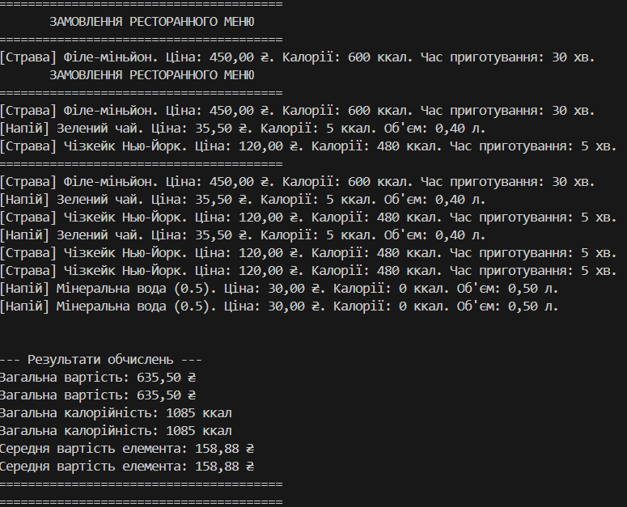

#  Звіт до Лабораторної роботи №4: Ресторанне Меню

## 1. Тема та Мета Роботи

### Тема
Реалізація принципів об'єктно-орієнтованого програмування (ООП): Інтерфейс, Абстрактний клас, Успадкування та Композиція на прикладі системи "Ресторанне меню".

### Мета
Практичне застосування ключових концепцій ООП в C#:
* **Створення та використання** інтерфейсу (`IMenuItem`) та абстрактного класу (`MenuItemBase`).
* **Реалізація** мінімум двох різних успадкованих класів (`Dish`, `Drink`).
* **Використання композиції** (або агрегації) для зв'язку між класами (клас `Order`).
* **Обчислення** загальної калорійності та середньої вартості замовлення.

---

## 2. Опис Виконання Завдання 

Завдання було реалізовано мовою C# з використанням консольного проєкту.

### 2.1. Абстракція та Інтерфейс

1.  **Інтерфейс `IMenuItem`**: Визначено контракт, який встановлює спільні вимоги для всіх елементів меню (назва, ціна, калорійність).
2.  **Абстрактний клас `MenuItemBase`**: Реалізовано для зберігання спільних даних (поля `Name`, `Price`, `Calories`) та забезпечення базової реалізації. Введено абстрактний метод `GetDetails()`, який забезпечує **поліморфну** поведінку.

### 2.2. Успадкування та Реалізації

* **Клас `Dish`**: Успадковує `MenuItemBase` і додає специфічне поле, наприклад, `PreparationTimeMinutes` (час приготування).
* **Клас `Drink`**: Успадковує `MenuItemBase` і додає специфічне поле, наприклад, `VolumeLiters` (об'єм).

### 2.3. Зв'язок та Обчислення

* **Клас `Order`**: Для об'єднання та розрахунку використано **композицію**. Клас `Order` містить приватний список `List<IMenuItem>`. Це дозволяє йому обробляти будь-які об'єкти, які відповідають контракту `IMenuItem`.
* **Обчислення**: Клас `Order` містить необхідні методи для розрахунків: `GetTotalCalories()`, `GetTotalPrice()` та `GetAverageItemPrice()`.

---

## 3. Приклади Запуску

Проєкт був успішно скомпільований та запущений за допомогою команди `dotnet run`.

### Вивід програми 

[Вставте тут скріншот виводу програми з терміналу після виконання `dotnet run`]

### Приклад результату
