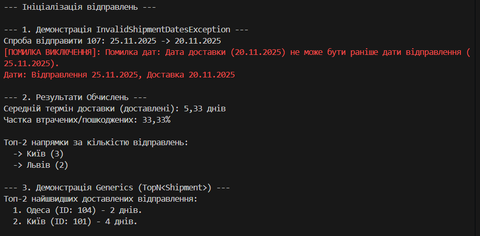

# Звіт до Лабораторної роботи №5: Пошта та Відправлення

## 1. Тема та Мета Роботи

### Тема
Реалізація принципів ООП: Композиція, Узагальнення (Generics), Контроль Вхідних Даних та Обробка Винятків на прикладі системи "Пошта/Відправлення".

### Мета
Практичне застосування ключових концепцій ООП в C#:
* **Моделювання предметної області** (`PostOffice` та `Shipment`).
* **Використання композиції** (`PostOffice` містить колекцію `Shipment`).
* **Реалізація узагальненого компонента** (метод `TopN<T>`).
* **Контроль вхідних даних** та створення власного винятку (`InvalidShipmentDatesException`).
* **Обчислення та агрегація даних** з колекцій (середнє, відсоток, топ-N).

---

## 2. Опис Виконання Завдання (C#)

Завдання було реалізовано мовою C#, усі вимоги виконані.

### 2.1. Контроль Вхідних Даних та Винятки

* **Власний Виняток**: Створено клас `InvalidShipmentDatesException`.
* **Контроль Дат**: Реалізовано перевірку в конструкторі класу `Shipment`: якщо `DeliveryDate` раніше, ніж `ShipmentDate`, генерується `InvalidShipmentDatesException`.
* **Обробка Помилок**: В `Program.cs` додано блок `try-catch` для демонстрації коректної обробки цього винятку.

### 2.2. Композиція та Сутності

* **Сутність `Shipment`**: Моделює одиничне відправлення з властивостями `ShipmentDate`, `DeliveryDate`, `DestinationCity` та `Status` (використовує `enum`).
* **Композиція `PostOffice`**: Клас `PostOffice` реалізує принцип композиції, містячи приватну колекцію `List<Shipment>`. Він виступає контейнером для всіх відправлень.

### 2.3. Обчислення з Колекціями

Клас `PostOffice` реалізує наступні операції з даними:
* **Середній термін доставки**: Обчислюється середня різниця в днях (`DeliveryDays`) лише для успішно доставлених відправлень, використовуючи LINQ-метод `Average()`.
* **Частка втрачених/пошкоджених**: Обчислюється відсоток відправлень зі статусом `Lost` або `Damaged` від загальної кількості відправлень.
* **Топ-напрямки**: Використовуються LINQ-методи `GroupBy`, `OrderByDescending` та `Take` для визначення міст з найбільшою кількістю відправлень.

### 2.4. Узагальнений Компонент (Generics)

* **Метод `TopN<T>`**: Реалізовано як метод розширення (extension method) для `IEnumerable<T>`. Метод дозволяє знаходити топ-N елементів (де `T` може бути будь-яким типом) на основі довільної числової метрики, визначеної за допомогою `Func<T, double>`.
    * *Демонстрація*: Використано для знаходження топ-2 **найшвидших** відправлень.

---

## 3. Приклади Запуску

Проєкт був успішно скомпільований та запущений за допомогою команди `dotnet run`.

### Вивід програми (Скріншот)

### Приклад результату