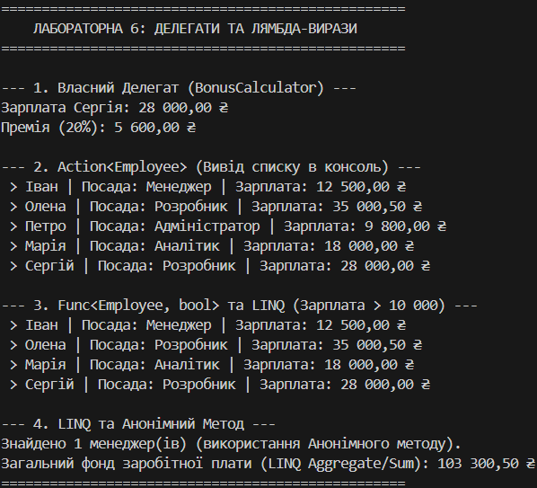

# 📄 Звіт до Лабораторної роботи №6: Лямбда-вирази, Делегати та LINQ (Варіант 5)

## 1. Мета Роботи

Закріпити знання про делегати, навчитись використовувати **лямбда-вирази** та **анонімні методи** для створення функціональності, а також застосувати вбудовані делегати C# (`Func`, `Action`, `Predicate`) для ефективної обробки колекцій об'єктів (`List<Employee>`).

## 2. Опис Виконання Завдання (C#)

Проєкт реалізовано мовою C#, усі вимоги та вимоги варіанта №5 виконані.

### 2.1. Клас Employee та Власний Делегат

* Створено клас `Employee` з полями **ім'я, посада, зарплата**.
* Оголошено власний делегат `BonusCalculator`, який приймає `decimal` та `double` і повертає `decimal` (для розрахунку премії). Реалізація делегата виконана за допомогою **лямбда-виразу**.

### 2.2. Вбудовані Делегати та LINQ

1.  **Action<Employee>** (вимога варіанту):
    * Використано для створення лямбда-виразу `displayEmployeeInfo`, який приймає об'єкт `Employee` і виводить його інформацію в консоль (не повертає значення).
2.  **Func<Employee, bool>** (вимога варіанту):
    * Використано для створення лямбда-виразу `highSalaryFilter`, який перевіряє умову **зарплата > 10 000**.
    * Цей делегат був переданий як аргумент методу розширення **`Where`** з LINQ для фільтрації колекції.
3.  **Анонімний Метод**:
    * Продемонстровано використання анонімного методу через делегат `Predicate<Employee>` для пошуку працівників на посаді "Розробник".

### 2.3. Обробка Колекції LINQ
Обробка колекції виконана за допомогою:
* **`Where`** (для фільтрації за зарплатою).
* **`OrderByDescending`** (для сортування за зарплатою).
* **`Select`** (для проекції імен).
* **`ForEach`** / **`FindAll`** (для ітерації та пошуку).

## 3. Приклади Запуску (Скріншот виводу програми)

### Приклад результату виводу