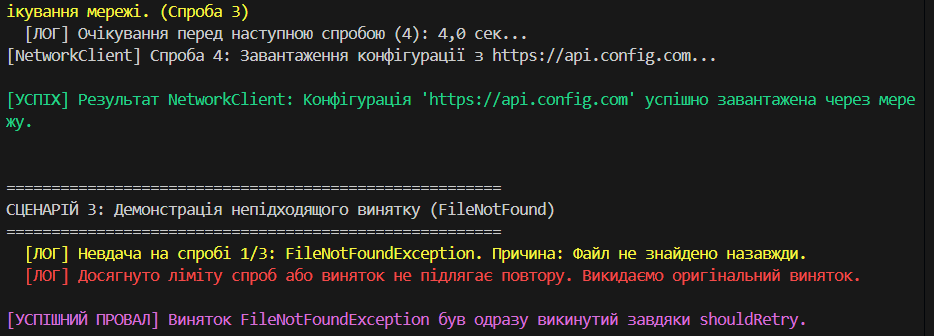

# Звіт до Лабораторної роботи №7: Патерн Retry та Експоненційна Затримка

## 1. Мета Роботи

Закріпити знання про механізми обробки винятків у C# (`try-catch-finally`) та навчитися реалізовувати просунутий патерн обробки тимчасових помилок — **Патерн Retry (Повторні спроби)**. Зокрема, реалізувати узагальнений метод з **Експоненційною затримкою** для забезпечення надійності операцій вводу/виводу та мережевих запитів.

## 2. Опис Виконання Завдання (C#)

Проєкт реалізовано мовою C#, усі вимоги виконані в класах `FileProcessor`, `NetworkClient` та узагальненому статичному класі `RetryHelper`.

### 2.1. Імітація Винятків (FileProcessor, NetworkClient)

Для демонстрації патерну Retry створено два класи, що імітують тимчасові помилки:
* **`FileProcessor`**: Метод `LoadConfiguration` імітує викидання `IOException` перші **2 рази**.
* **`NetworkClient`**: Метод `DownloadConfiguration` імітує викидання `HttpRequestException` перші **3 рази**.
* Кожен метод використовує внутрішній лічильник, щоб забезпечити успішне виконання операції після заданої кількості невдач.

### 2.2. Реалізація Узагальненого RetryHelper

Створено статичний клас `RetryHelper` з узагальненим методом `public static T ExecuteWithRetry<T>(...)`.

#### 1. Експоненційна Затримка
Затримка між спробами реалізована за формулою:
$$\text{Затримка} = \text{Початкова Затримка} \times 2^{(\text{Спроба} - 1)}$$
Це дозволяє уникнути перевантаження ресурсу, який зазнав тимчасової невдачі, даючи йому час на відновлення.

#### 2. Вибірковий Повтор (`shouldRetry`)
Реалізовано делегат `Func<Exception, bool> shouldRetry`. Він дозволяє користувачеві визначати політику: повторювати спробу **тільки для очікуваних тимчасових винятків** (наприклад, `HttpRequestException`) та **не повторювати** для фатальних або невідновлюваних помилок (наприклад, `FileNotFoundException`). У Сценарії 3 показано, як `FileNotFoundException` одразу призводить до викиду винятку, оскільки він не підлягає повтору.

#### 3. Логування
Кожна спроба виконання та причина невдачі детально логуються в консоль, включаючи інформацію про майбутню затримку.

## 3. Приклади Запуску та Сценарії

У методі `Main()` продемонстровано три сценарії, які повністю покривають вимоги завдання.

### Сценарій 1: FileProcessor (Успішний повтор після 2-х невдач)
* Операція: `LoadConfiguration`.
* Результат: Операція **успішно** виконується на **3-й спробі** завдяки повторам.

### Сценарій 2: NetworkClient (Успішний повтор після 3-х невдач)
* Операція: `DownloadConfiguration`.
* Політика: Повторювати лише для `HttpRequestException`.
* Результат: Операція **успішно** виконується на **4-й спробі**.

### Сценарій 3: Демонстрація Непідходящого Винятку
* Операція: Імітує `FileNotFoundException`.
* Політика: `shouldRetry` повертає `false` для `FileNotFoundException`.
* Результат: Операція **не повторюється**; виняток одразу обробляється (успішний провал). Це підтверджує роботу політики вибіркового повтору.

### Вивід програми (Скріншот)

> **Примітка:** Наданий скріншот демонструє успішне виконання Сценарію 2 та коректну роботу політики у Сценарії 3.
